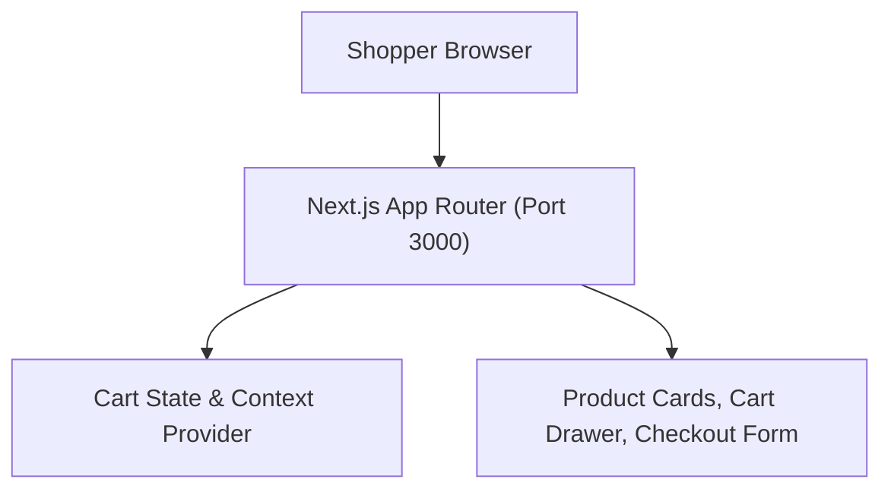
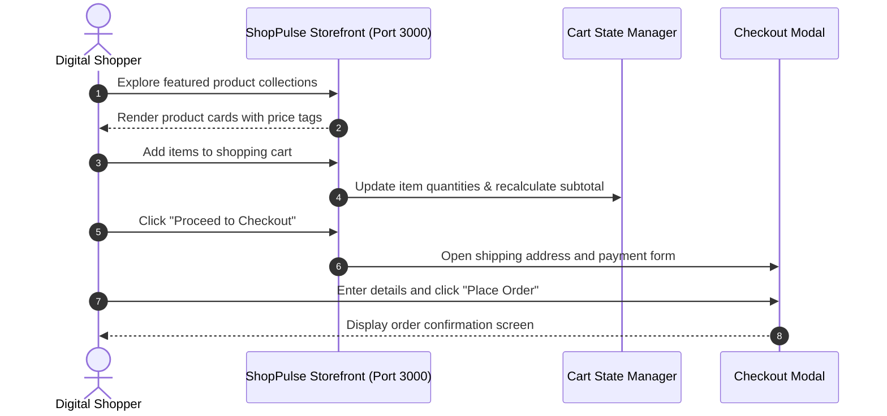

# ShopPulse — Modern Digital Storefront & E-Commerce Web App
[]()
[]()
[]()
[]()

## Overview
ShopPulse is a full-featured modern e-commerce storefront web application built with Next.js 15, React, Tailwind CSS, and Radix UI. It provides high-speed product catalog browsing, detailed item views, dynamic shopping cart management, user account profiles, and an interactive checkout experience.

- **Problem Solved:** Fast, SEO-optimized digital retail shopping experience.
- **Target Users:** Online consumers and digital store operators.
- **Current Status:** Functional Web Application.

## Features
- **Product Catalog & Filtering:** Search and filter by category, price, and customer rating.
- **Persistent Cart Drawer:** Real-time quantity adjustments, subtotal computation, and cart state storage.
- **User Account Area:** Order history, shipping addresses, and personal profile management.
- **Modern Responsive Design:** Clean e-commerce design system with dark/light themes.

## Architecture


## User Flow


## Technology Stack
| Layer | Technology | Purpose |
|---|---|---|
| Framework | Next.js 15 (App Router) | Server-rendered React application |
| Language | TypeScript | Type safety and domain models |
| Styling | Tailwind CSS, Radix UI | Modern storefront component library |
| Icons | Lucide React | High-clarity vector icons |

## Infrastructure
- **Server Port:** 3000
- **Hosting Target:** Vercel Edge Network

## Project Structure
```text
Project/
├── src/
│   ├── app/             # Next.js App Router (cart, account, products)
│   ├── components/      # ProductCard, CartDrawer, Navbar, Footer
│   ├── context/         # CartContext and session state
│   └── lib/             # Utility helpers and mock catalog
├── package.json         # Dependencies
├── next.config.ts       # Next.js configuration
├── .gitignore           # Git ignore definitions
└── README.md            # Technical documentation
```

## Prerequisites
- Node.js >= 18.x
- npm >= 9.x

## Environment Variables
Create `.env.local` using placeholders:
```env
NEXT_PUBLIC_STORE_NAME=ShopPulse
NEXT_PUBLIC_STRIPE_KEY=your_stripe_publishable_key_optional
```

## Local Development Setup
1. Clone the repository:
   ```bash
   git clone https://github.com/Bhanutejanallamothu/Project.git
   cd Project
   ```
2. Install dependencies:
   ```bash
   npm install
   ```
3. Run development server:
   ```bash
   npm run dev
   ```
4. Access store at `http://localhost:3000`.

## Docker Setup
*Not detected in repository. Standard Next.js container configuration supported.*

## Database Setup
*Not applicable in standalone prototype mode.*

## API Documentation
Internal Next.js server actions and API endpoints for cart and account state.

## Deployment
```bash
npm run build
```
Deploy to Vercel with zero configuration.

## Security
- Input sanitization on checkout forms.
- Safe client-side price computation with server validation verification.

## Testing
```bash
npm run lint
```

## Troubleshooting
- **Hydration Warning:** Ensure browser extensions do not inject arbitrary HTML into the DOM tree.

## Future Improvements
- Live payment processing via Stripe Checkout.
- Product reviews and customer rating submission.

## License
All rights reserved by repository owner.
